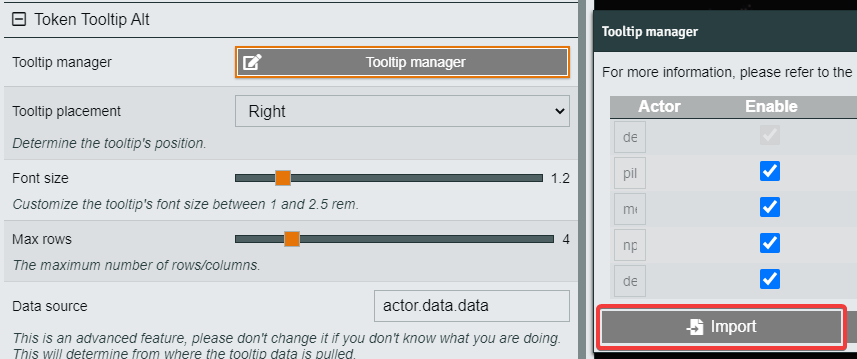

# Lancer Token Tooltip Alt Configs

This repo was created to store [Token Tooltip Alt](https://foundryvtt.com/packages/token-tooltip-alt) configurations for the [Foundry VTT Lancer System](https://foundryvtt.com/packages/lancer).

Install from [this fork](https://github.com/msprijatelj/token-tooltip-alt/releases/latest/download/module.zip) for compatibility with Foundry v11.

In order to use these config options, make sure to open the tooltip manager in the module's settings, and then import one of the json files in this repo.

Following that, there may be extra configuration for each config - the TTA settings are held below.

## Bolts TTA Config

- File: `bolts-tta.json`
- Actor Data: `actor.system`
- Max Rows: `4`  

## Eranziel TTA Config

- File: `eranziel-tta.json`
- Actor Data: `actor.system`
- Max Rows: `4`
- Tooltip Manager:
  - Custom:
    - [x] Deployable

## KuroKitten TTA Config

- File: `kurokitten-tta.json`
- Actor Data: `actor.data.data.derived`
- Max Rows: `4`
- Tooltip Manager:
  - Custom:
    - [x] Pilot
    - [x] Mech
    - [x] NPC
    - [x] Deployable

## Sarah TTA Config
Variant of KuroKitten's. Only includes NPC class and up to 4 templates for hostile, neutral, and friendly NPCs. Auto-capitalizes class and template names. Does not include config for pilots, player mechs, or deployables.
- File: `sarah-tta.json`
- Actor Data: `actor.data.data.derived`
- Max Rows: `5`
- Tooltip Manager:
  - Custom:
   - [ ] Pilot
   - [ ] Mech
   - [x] NPC
   - [ ] Deployable

## Valkyrion
### TTA Config
Variant of KuroKitten's.  Includes Frame type (e.g. `BLACKBEARD`) and Pilot's Callsign for friendly mechs.  Allows token name to accommodate longer Mech names instead of just the pilot Callsign.  Works best with token display names never displayed.
- File: `valkyrion-tta.json`
- Actor Data: `actor`
- Max Rows: `4`
- Tooltip Manager:
  - Custom:
    - [x] Pilot
    - [x] Mech
    - [x] NPC
    - [x] Deployable

